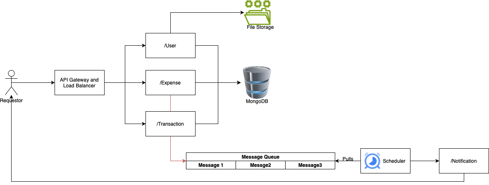

# Splitwise

Splitwise is an application to help users split bills and expenses among friends, roommates, or groups. It simplifies the process of managing shared expenses by allowing users to track and settle debts easily.

## Table of contents

- Requirements
- Installation
- Architecture
- Database
- Classes
- Open Issues

## Requirements

- Python >= 3.10
- MongoDB Community [Install](https://www.mongodb.com/docs/manual/installation/)

## Installation

- Clone the repository:
```bash
git clone git@github.com:PulkitNijhawan/Splitwise.git
```
- Use the package manager [pip](https://pip.pypa.io/en/stable/) to install virtualenv and piping.
```bash
pip install virtualenv pipenv
```
- Navigate to the project directory and open a terminal.
- Set up a virtual environment (optional but recommended):
```bash
python3 -m venv venv
```
- Activate the virtual environment:
  - For Windows:
    ```bash
    venv\Scripts\activate
    ```
  - For MacOS/Linux:
    ```bash
    source venv/bin/activate
    ```

- Install the dependencies:
```bash
pipenv install
```

- Start the [MongoDB](https://www.mongodb.com/docs/manual/installation/) on your local machine and link the `URI` in `app.config["MONGO_URI"]`.

- Run the server:
```bash
python run.py
```

## Architecture


## Database


## APIs

1.  **(/user)** : This endpoint register user on platform.

    ### Curl:

    ```
    curl --location --request POST 'http://127.0.0.1:5000/register-user/' \
    --header 'Content-Type: application/json' \
    --data-raw '{
        "name": "abc",
        "email": "abc@testDomain.com",
        "phone_number": "9999999999"
    }'
    ```

    ### Returns:

    ```
        {
            "user_uid": (string),
            "name": "abc",
            "email": "abc@testDomain.com",
            "phone_number": "9999999999"
        }
    ```


2.  **(/expense)** : Adds a new expense to the app.

    ### Curl:

    ```
    curl --location --request POST 'http://127.0.0.1:5000/expense/' \
    --header 'Content-Type: application/json' \
    --data-raw '{
        "expense_type": "equal",
        "owed_by": <uid>,
        "paid_by": [uid_1, uid_2..],
        "amount": 12.0
    }'
    ```

    ### Returns:

    ```
        {
            uid_1 owes uid2 Rs. x
            ...
        }
    ```

3.  **(/transaction/<user_id>?simplify=True)** : This endpoint gets all transaction involving `user_id`.
> If simplify is true endpoint would calculate simplified version of transactions.

    ### Curl:

    ```
    curl --location --request GET 'http://127.0.0.1:5000/expense/' \
    --header 'Content-Type: application/json' \
    --data-raw '{}'
    ```

    ### Returns:

    ```
        {
            uid_1 owes uid2 Rs. x
            ...
        }
    ```

4.  **(/transactions?simplify=True)** : This endpoint gets all transactions.
> If simplify is true endpoint would calculate simplified version of transactions.

    ### Curl:

    ```
    curl --location --request GET 'http://127.0.0.1:5000/expense/' \
    --header 'Content-Type: application/json' \
    --data-raw '{}'
    ```

    ### Returns:

    ```
        {
            uid_1 owes uid2 Rs. x
            ...
        }
    ```

5.  **(/expense/<user_id>)** : Generates balance and passbook for a user.

    ### Curl:

    ```
    curl --location --request POST 'http://127.0.0.1:5000/expense/<uid_1>' \
    --header 'Content-Type: application/json' \
    --data-raw '{}'
    ```

    ### Returns:

    ```
        {
            uid_1 owes uid2 Rs. x
            ...
        }
    ```

# Classes
1. UserService: Deals with all the request incoming for user.
2. Expense: Deals with all the expense related request and uses CreateTrasaction class to handle transaction for particular expense.
3. Transaction: Deals with create and fetch requests for transaction and simplifies the result using TransactionsSimplifier class.
4. TransactionSimplifier: Uses greedy algorithm to simplify a given set of transactions.

# Open Issues

- Due to time constraints regression testing was not possible.
- Messaging service is not implemented yet.


